# アーキテクチャ設計

> 北海道 道の駅コレクション -- spec.md v3 ベースのアーキテクチャ設計書

---

## 1. システム構成図

### 1.1 全体構成

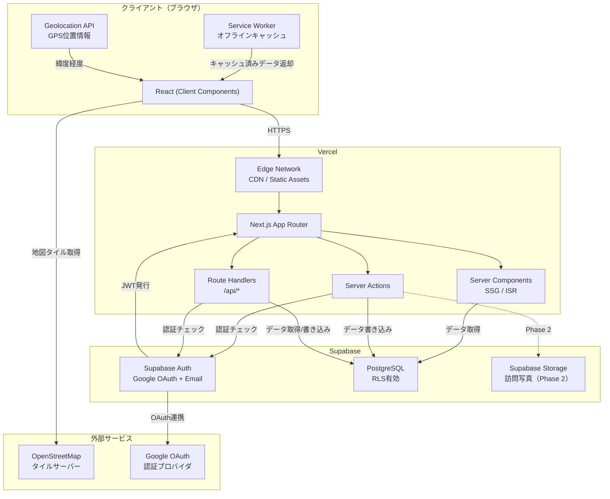

### 1.2 リクエストフロー概要

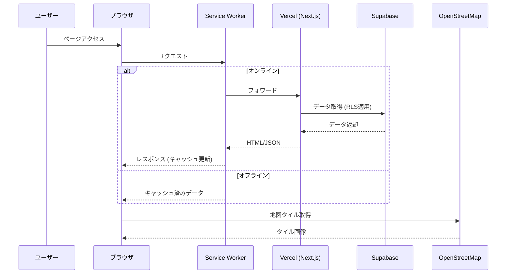

---

## 2. レイヤー構成（Next.js App Router ベース）

### 2.1 レイヤー図

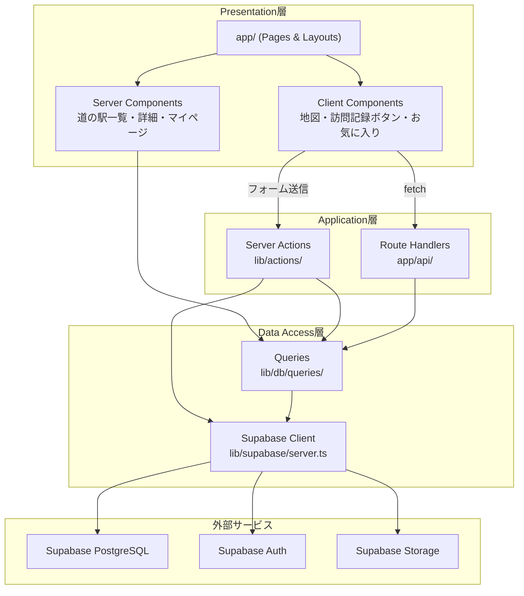

### 2.2 各層の責務

| レイヤー | ディレクトリ | 責務 | 依存先 |
|---------|------------|------|--------|
| **Presentation** | `app/`, `components/` | UI描画、ルーティング、レイアウト、ユーザー入力の受け取り | Application層 |
| **Application** | `lib/actions/`, `app/api/` | ユースケースの実行、バリデーション（Zod）、認証チェック、revalidate | Data Access層 |
| **Data Access** | `lib/db/queries/` | Supabase Client経由のDB読み取り、RLSに基づくアクセス制御 | Supabase |
| **共通** | `lib/utils/`, `lib/constants/`, `lib/validations/`, `types/`, `hooks/` | 型定義、バリデーションスキーマ、ヘルパー関数、カスタムフック | なし（純粋関数） |

### 2.3 依存関係のルール

- **Presentation -> Application -> Data Access** の一方向のみ許可
- Data Access層は `server-only` でマークし、Client Componentから直接インポートできないようにする
- Application層（Server Actions）は `'use server'` でマークする
- Client ComponentからData Access層を呼ぶ場合は、必ずServer ActionsまたはRoute Handlers経由にする
- 型定義（`types/`）は全レイヤーから参照可能
- データ書き込みは Server Actions が直接 Supabase Client を使用する（`lib/db/mutations/` は設けない）

---

## 3. コンポーネント設計

### 3.1 地図コンポーネント

| 項目 | 内容 |
|------|------|
| **種別** | Client Component (`'use client'`) |
| **ディレクトリ** | `components/features/map/` |
| **技術** | Leaflet + react-leaflet |
| **責務** | 地図描画、道の駅ピン表示、現在地表示、ピンタップ時の概要カード表示 |

```
components/features/map/
  MapContainer.tsx         -- 地図の初期化・表示（Client Component）
  StationMarkers.tsx       -- 道の駅ピン群の描画（訪問状態に応じた色分け）
  StationPopup.tsx         -- ピンタップ時の概要カード
  CurrentLocationButton.tsx -- 現在地取得ボタン
  MapFilterPanel.tsx       -- エリア・訪問状態フィルタ（道東/道北/道央/道南）
  useMapState.ts           -- 地図の状態管理フック
```

**依存関係:**
- `leaflet`, `react-leaflet`: 地図描画ライブラリ
- OpenStreetMap タイルサーバー: `https://tile.openstreetmap.org/{z}/{x}/{y}.png`
- `types/station.ts`: 道の駅型定義
- Server Componentから道の駅データをpropsで受け取る（`StationMarkers`が配列を受ける）

**設計判断:**
- Leaflet はブラウザ依存のため `'use client'` 必須。`dynamic(() => import(...), { ssr: false })` でSSR無効化する
- 約130箇所のピンはクラスタリング不要（数が少ない）。全ピンを一括描画する
- ログインユーザーの訪問状態（ゴールド/シルバー/未訪問）はServer Componentでフェッチし、propsで渡す

### 3.2 道の駅一覧・詳細

| 項目 | 内容 |
|------|------|
| **種別** | Server Component（SSG/ISR） |
| **ディレクトリ** | `app/stations/`, `components/features/station/` |
| **責務** | 道の駅データの表示、SEO対応 |

```
app/stations/
  page.tsx                 -- 一覧ページ（Server Component、ISR）
  [id]/page.tsx            -- 詳細ページ（Server Component、SSG + ISR）
  [id]/layout.tsx          -- 詳細ページレイアウト

components/features/station/
  StationCard.tsx          -- 一覧カード（写真・名前・エリア・バッジ）
  StationList.tsx          -- カード一覧表示
  StationDetail.tsx        -- 詳細情報表示
  FacilityIcons.tsx        -- 設備アイコン群（トイレ・EV・Wi-Fi等）
  StationSearchBar.tsx     -- キーワード検索（Client Component）
```

**データ取得戦略:**
- `app/stations/page.tsx`: ISR（`revalidate: 3600` = 1時間）で一覧を生成
- `app/stations/[id]/page.tsx`: `generateStaticParams()` で全130箇所をSSG。ISR（`revalidate: 3600`）で更新
- SEOメタデータは `generateMetadata()` で動的生成

### 3.3 訪問記録

| 項目 | 内容 |
|------|------|
| **種別** | Client Component + Server Action |
| **ディレクトリ** | `components/features/visit/`, `lib/actions/visits.ts` |
| **責務** | GPS取得、訪問記録、ゴールド/シルバーバッジ判定 |

```
components/features/visit/
  VisitButton.tsx          -- 「訪問した！」ボタン（Client Component）
  VisitForm.tsx            -- メモ入力フォーム（Client Component）
  VisitBadge.tsx           -- ゴールド/シルバーバッジ表示
  GPSStatus.tsx            -- GPS取得状態の表示

lib/actions/visits.ts      -- 訪問記録Server Action（createVisit, deleteVisit）
lib/utils/geo.ts           -- GPS距離計算ユーティリティ（calculateDistance, isWithinRadius）
```

**バッジ判定ロジック:**

```
1. ユーザーが「訪問した！」ボタンをタップ
2. Geolocation API で現在地を取得（任意、拒否可能）
3. GPSが取得できた場合:
   - 道の駅座標との距離を Haversine公式 で計算
   - 距離 <= 1km → is_gps_verified = true（ゴールドバッジ）
   - 距離 > 1km → is_gps_verified = false（シルバーバッジ）
4. GPSが取得できなかった場合:
   - is_gps_verified = false（シルバーバッジ）
5. Server Action で visits テーブルに INSERT
```

**インターフェース（Server Action）:**

```typescript
// lib/actions/visits.ts
'use server'
type VisitInput = {
  stationId: string;
  visitedAt: string;      // ISO 8601 date
  memo?: string;
  latitude?: number;       // GPS緯度（任意）
  longitude?: number;      // GPS経度（任意）
};

type VisitResult = {
  success: boolean;
  isGpsVerified: boolean;
  error?: { fieldErrors: Record<string, string[]> };
};

export async function createVisit(input: VisitInput): Promise<VisitResult>;
```

### 3.4 認証

| 項目 | 内容 |
|------|------|
| **種別** | Supabase Auth 統合 |
| **ディレクトリ** | `app/(auth)/`, `app/api/auth/`, `lib/supabase/`, `components/features/auth/` |
| **責務** | ログイン/ログアウト、セッション管理、プロフィール管理 |

```
app/(auth)/
  login/page.tsx           -- ログインページ
  signup/page.tsx          -- 新規登録ページ

app/api/auth/
  callback/route.ts        -- OAuth コールバック処理（Route Handler）

lib/supabase/
  server.ts                -- サーバー側 Supabase Client（cookies()使用）
  client.ts                -- クライアント側 Supabase Client

components/features/auth/
  LoginForm.tsx            -- ログインフォーム（Client Component）
  SignupForm.tsx           -- 新規登録フォーム（Client Component）
  AuthButton.tsx           -- ログイン/ログアウトボタン
  OAuthButtons.tsx         -- Google OAuthボタン
```

**認証フロー（Google OAuth）:**

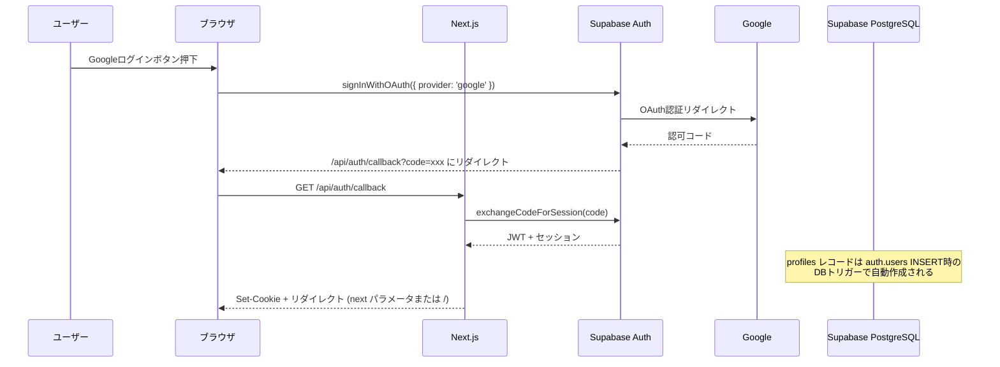

**セッション管理:**
- Supabase Auth のセッションは Cookie ベースで管理
- Server Component では `lib/supabase/server.ts`（`cookies()` 経由）でセッションを取得
- Client Component では `lib/supabase/client.ts` でセッションを取得
- Middleware（`middleware.ts`）でセッションのリフレッシュを行う

**profiles 自動作成:**
- profiles レコードは Supabase の DB トリガー（`auth.users` テーブルへの INSERT 時）で自動作成される
- OAuth コールバック Route Handler (`app/api/auth/callback/route.ts`) では profiles の作成は行わない
- これにより、Email + Password 登録時も同じ仕組みで profiles が作成される

### 3.5 お気に入り管理

| 項目 | 内容 |
|------|------|
| **種別** | Client Component + Server Action |
| **ディレクトリ** | `components/features/favorite/`, `lib/actions/favorites.ts` |
| **責務** | お気に入り追加/解除、リスト表示、地図上の表示連携 |

```
components/features/favorite/
  FavoriteButton.tsx       -- ハートアイコンのトグルボタン（Client Component）
  FavoriteList.tsx         -- お気に入り一覧（Server Component）

lib/actions/favorites.ts   -- お気に入りServer Action（addFavorite, removeFavorite）
lib/db/queries/favorites.ts -- お気に入り取得クエリ
```

**インターフェース:**

```typescript
// lib/actions/favorites.ts
'use server'

/** お気に入りに追加する。既にお気に入り済みの場合は CONFLICT エラーを返す */
export async function addFavorite(stationId: string): Promise<ActionResult<{ id: string }>>;

/** お気に入りから解除する */
export async function removeFavorite(stationId: string): Promise<ActionResult<void>>;
```

**設計判断:**
- お気に入りの追加/解除は楽観的更新（Optimistic Update）で即座にUI反映する
- `FavoriteButton` は `useOptimistic` フック（React 19）を使用
- `addFavorite` と `removeFavorite` を分離し、クライアント側で現在の状態に応じて呼び分ける

### 3.6 ゲーミフィケーション（バッジ判定）

| 項目 | 内容 |
|------|------|
| **種別** | サーバーサイドロジック |
| **ディレクトリ** | `lib/utils/badges.ts`, `lib/constants/badges.ts`, `components/features/badge/` |
| **責務** | エリア制覇バッジ・マイルストーン判定、バッジ表示 |

```
lib/utils/badges.ts        -- バッジ判定ロジック（純粋関数）
lib/constants/badges.ts    -- バッジ定義定数（BADGE_DEFINITIONS）
lib/db/queries/badges.ts   -- 訪問数・エリア別達成状況クエリ

components/features/badge/
  BadgeCard.tsx            -- バッジカード（獲得済み/未獲得）
  BadgeList.tsx            -- バッジ一覧
  MilestoneProgress.tsx    -- マイルストーン進捗表示
  AreaProgress.tsx         -- エリア制覇進捗表示
```

**バッジ判定ロジック:**

```typescript
// lib/utils/badges.ts

// マイルストーンバッジ: 訪問した道の駅のユニーク数で判定
const MILESTONES = [10, 30, 50, 100, 130] as const;

type MilestoneBadge = {
  threshold: number;
  achieved: boolean;
  achievedAt?: Date;
};

// エリア制覇バッジ: エリア内の全道の駅を訪問で判定
type AreaBadge = {
  areaGroup: '道東' | '道北' | '道央' | '道南';
  totalStations: number;
  visitedStations: number;
  achieved: boolean;
};
```

**設計判断:**
- バッジ判定はリアルタイム計算（DB問い合わせ時にCOUNTで算出）
- バッジテーブルは設けず、visitsテーブルのデータから都度計算する（130箇所程度なのでパフォーマンス問題なし）
- 将来的にユーザー数が増えた場合は、マテリアライズドビューまたはキャッシュテーブルの導入を検討

### 3.7 オフラインキャッシュ（Service Worker）

| 項目 | 内容 |
|------|------|
| **種別** | Service Worker |
| **ディレクトリ** | プロジェクトルート（next-pwa等で生成） |
| **責務** | 道の駅データのキャッシュ、オフライン時の閲覧提供 |

**キャッシュ戦略:**

| リソース | 戦略 | TTL | 備考 |
|---------|------|-----|------|
| 道の駅一覧API（`/api/stations`） | Stale-While-Revalidate | 24時間 | オフラインの主要データ |
| 道の駅詳細ページHTML | Network First | 1時間 | オフライン時はキャッシュ返却 |
| 静的アセット（JS/CSS/画像） | Cache First | 7日間 | ビルドハッシュで自動更新 |
| 地図タイル | キャッシュしない | - | Phase 3以降で検討 |
| 認証が必要なAPI | キャッシュしない | - | 個人データはキャッシュ対象外 |

**オフライン時の動作:**

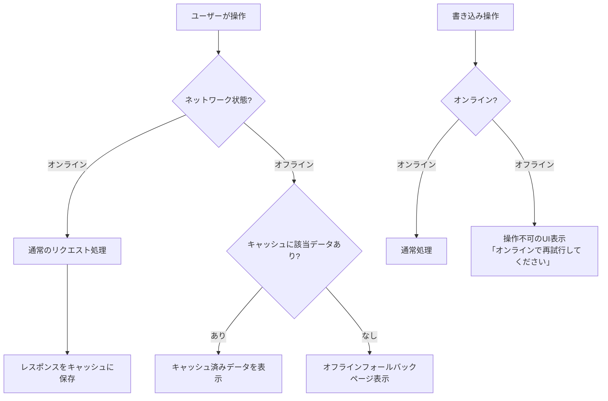

**設計判断:**
- Phase 1ではオフライン書き込みは対象外（コンフリクト処理の複雑さ回避）
- 認証が必要なデータ（訪問記録、お気に入り）はキャッシュしない
- `navigator.onLine` と `online`/`offline` イベントでネットワーク状態を監視し、UIに反映する

---

## 4. データフロー

### 4.1 地図表示 -> 道の駅ピン表示

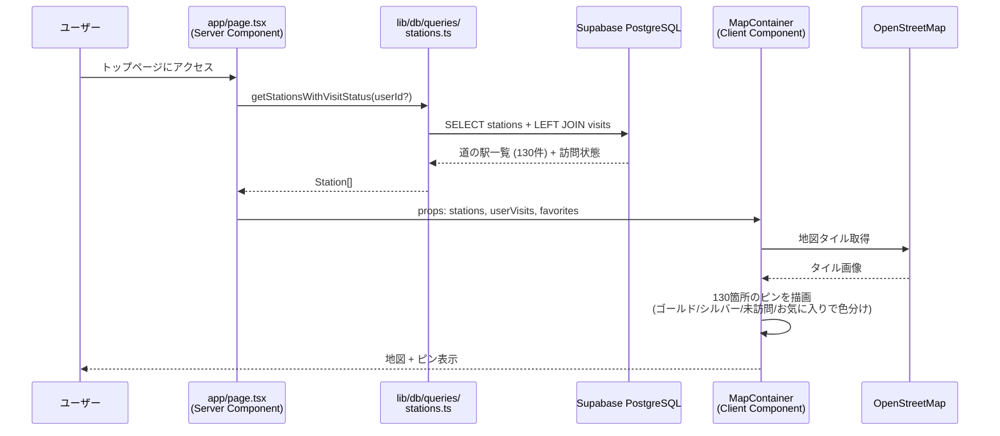

### 4.2 訪問記録（GPS取得 -> バッジ判定 -> DB保存）

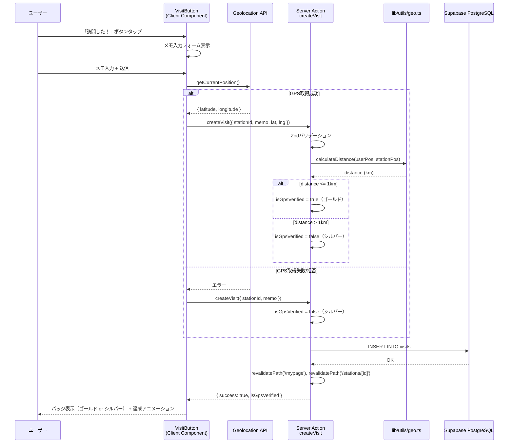

### 4.3 お気に入り登録

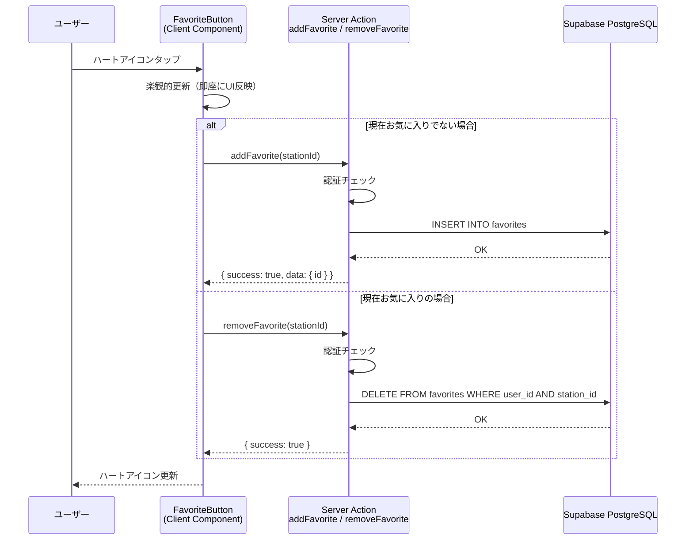

### 4.4 オフライン閲覧

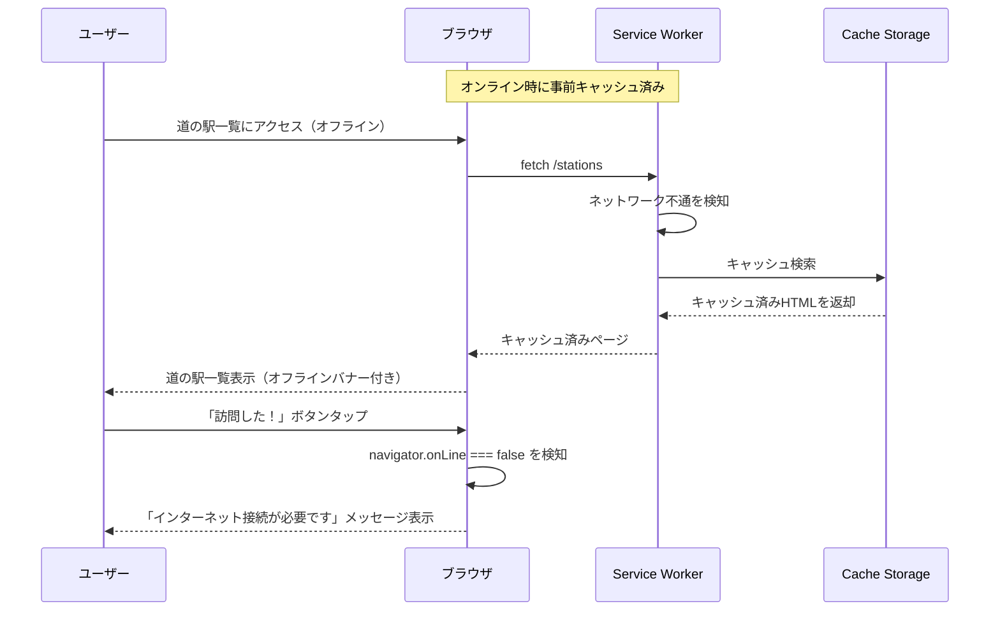

---

## 5. セキュリティ設計

### 5.1 認証フロー

**方式:** Supabase Auth（JWT + Cookie）

| 認証方法 | 説明 |
|---------|------|
| Google OAuth 2.0 | Supabase Auth経由でGoogleログイン。`/api/auth/callback` Route Handlerでトークン交換 |
| Email + Password | Supabase Auth のビルトイン機能。メール確認フロー付き |

**セッション管理:**
- JWTは HttpOnly Cookie に格納（Supabase Auth SDK が自動管理）
- アクセストークンの有効期限: 1時間（Supabase デフォルト）
- リフレッシュトークンで自動更新
- `middleware.ts` でリクエスト毎にセッションをリフレッシュ

### 5.2 認可（RLS）

Supabase PostgreSQL の Row Level Security で、全テーブルのアクセス制御をDB層で強制する。

| テーブル | SELECT | INSERT | UPDATE | DELETE |
|---------|--------|--------|--------|--------|
| stations | 全ユーザー（未認証含む） | 管理者のみ | 管理者のみ | 管理者のみ |
| profiles | 本人のみ | 認証時自動作成（DBトリガー） | 本人のみ | 不可 |
| visits | 本人のみ | 認証ユーザー（user_id = auth.uid()） | 本人のみ | 本人のみ |
| favorites | 本人のみ | 認証ユーザー（user_id = auth.uid()） | 不可 | 本人のみ |
| station_reports (Phase 2) | 管理者: 全件 / 一般: 本人のみ | 認証ユーザー | 管理者のみ（ステータス更新） | 管理者のみ |
| station_tips (Phase 3) | 全ユーザー（未認証含む） | 認証ユーザー | 本人のみ | 本人のみ / 管理者 |

**RLSポリシー例（visits）:**

```sql
-- SELECT: 自分の訪問記録のみ
CREATE POLICY "Users can view own visits"
  ON visits FOR SELECT
  USING (auth.uid() = user_id);

-- INSERT: 認証ユーザーが自分のデータとして挿入
CREATE POLICY "Users can insert own visits"
  ON visits FOR INSERT
  WITH CHECK (auth.uid() = user_id);
```

### 5.3 環境変数管理

| 変数名 | 公開範囲 | 用途 |
|--------|---------|------|
| `NEXT_PUBLIC_SUPABASE_URL` | ブラウザ + サーバー | Supabase プロジェクトURL |
| `NEXT_PUBLIC_SUPABASE_ANON_KEY` | ブラウザ + サーバー | Supabase 匿名キー（RLSで保護） |
| `SUPABASE_SERVICE_ROLE_KEY` | サーバーのみ | 管理者操作用（RLSバイパス）。Server Actions/Route Handlersのみで使用 |
| `GOOGLE_CLIENT_ID` | サーバーのみ（Supabase設定） | Google OAuth クライアントID |
| `GOOGLE_CLIENT_SECRET` | サーバーのみ（Supabase設定） | Google OAuth シークレット |

**ルール:**
- `NEXT_PUBLIC_` プレフィックス付きの変数のみがブラウザに露出する
- `SUPABASE_SERVICE_ROLE_KEY` は絶対にクライアントに渡さない。`server-only` モジュールでのみ使用する
- Vercel の Environment Variables 機能で環境ごとに管理（preview / production）

### 5.4 XSS・CSP対策

| 対策 | 実装方法 |
|------|---------|
| XSS | React のデフォルトエスケープ + `dangerouslySetInnerHTML` 不使用 |
| CSP | `next.config.ts` の `headers()` で Content-Security-Policy 設定 |
| CSRF | Server Actions は Next.js が自動でCSRFトークンを管理 |
| 入力検証 | 全Server ActionsでZodバリデーション必須 |

**CSPヘッダー設定方針:**

```
default-src 'self';
script-src 'self' 'unsafe-eval' 'unsafe-inline';  # Next.js要件
style-src 'self' 'unsafe-inline';                   # Tailwind CSS要件
img-src 'self' data: https://tile.openstreetmap.org https://*.supabase.co;
connect-src 'self' https://*.supabase.co;
font-src 'self';
```

---

## 6. インフラ構成

### 6.1 構成図

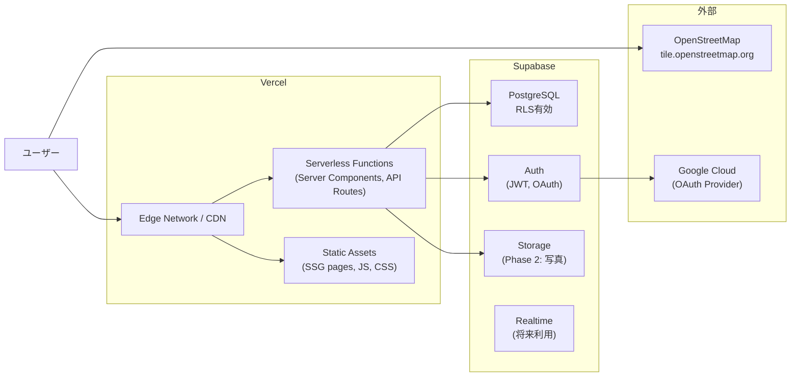

### 6.2 環境一覧

| 環境 | 用途 | Vercel | Supabase | URL |
|------|------|--------|----------|-----|
| **local** | 開発 | `next dev`（localhost:3000） | Supabase CLI（ローカルDocker） or クラウドdev | `http://localhost:3000` |
| **staging** | 検証・レビュー | Vercel Preview Deployments | Supabase staging プロジェクト | `https://staging.michinoeki-log.vercel.app` |
| **production** | 本番 | Vercel Production | Supabase production プロジェクト | `https://michinoeki-log.vercel.app`（仮） |

### 6.3 リソース制限（無料枠）

| サービス | プラン | 主要制限 | 備考 |
|---------|------|---------|------|
| Vercel | Hobby | 帯域100GB/月、Serverless実行時間100h/月 | 個人プロジェクトなら十分 |
| Supabase | Free | DB 500MB、Storage 1GB、MAU 5万、Edge Functions 50万回/月 | 130箇所+少数ユーザーなら余裕 |
| OpenStreetMap | 無料 | 利用規約に準拠（大量アクセス禁止） | 本アプリ規模では問題なし |

### 6.4 デプロイフロー

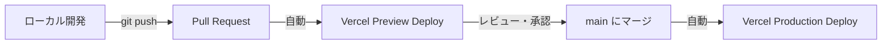

- Vercel の Git Integration により、PR作成時にPreview環境が自動デプロイされる
- mainブランチへのマージで本番自動デプロイ
- Supabaseのマイグレーションは `npx supabase db push`（staging）/ `npx supabase migration deploy`（production）で手動実行

---

## 7. 技術選定理由

| 技術 | 選定理由 | 検討した代替案 | 不採用理由 |
|------|---------|-------------|-----------|
| **Next.js 15 (App Router)** | Server Components/Actions によるフルスタック開発、SSG/ISRでSEO対応、Vercelとの最適統合 | Remix, Nuxt.js | Vercelとの統合度でNext.jsが優位。React Server Componentsのエコシステムが最も成熟 |
| **React 19** | Server Components、`useOptimistic` 等の最新APIがお気に入りUI等に活用可能。Next.js 15の要件 | - | Next.js 15で事実上必須 |
| **TypeScript 5.x (strict)** | 型安全性によるバグ防止、IDEサポート、Zodとの相性 | JavaScript | 130箇所分のデータ型管理、Server Actions/Client間の型共有でTypeScriptは必須 |
| **Tailwind CSS 4.x + shadcn/ui** | ユーティリティファーストで高速UI構築、shadcn/uiでアクセシブルなコンポーネント | MUI, Chakra UI | バンドルサイズの軽量さ。shadcn/uiはコピーベースでカスタマイズ自由 |
| **Leaflet + react-leaflet** | 無料、軽量、OSS。OpenStreetMapとの標準的な組み合わせ | Mapbox GL JS, Google Maps | Mapboxは商用利用で有料。Google Mapsはコスト制約（spec.mdで不使用と明記） |
| **OpenStreetMap** | 完全無料、API Key不要、日本の道路データも充実 | Google Maps, 国土地理院タイル | Google Mapsはコスト面で不適。国土地理院は見た目がやや専門的 |
| **Supabase (PostgreSQL)** | PostgreSQL + Auth + Storage + RLS が一体。無料枠で十分なスペック。リアルタイム機能も将来利用可能 | Firebase, PlanetScale | Firebaseはリレーショナルモデルに不向き（NoSQL）。PlanetScaleはAuth/Storage一体提供なし |
| **Supabase Auth** | Google OAuth + Email認証が簡単に実装可能。RLSとの統合（`auth.uid()`） | NextAuth.js, Clerk | Supabase DBのRLSと直接統合できるのが最大の利点。別サービスではJWT検証が二重になる |
| **Zod** | Server ActionsのランタイムバリデーションとTypeScript型推論の両立 | Yup, io-ts | Next.js公式ドキュメントで推奨。TypeScript型推論が最も優秀 |
| **Service Worker (next-pwa等)** | 北海道の電波不安定エリア対策。閲覧データのキャッシュに特化 | Workbox単体 | next-pwa等のNext.js統合ライブラリでセットアップが簡単 |
| **Vercel** | Next.jsの開発元。ゼロコンフィグデプロイ、Edge Network、Preview Deployments | Cloudflare Pages, AWS Amplify | Next.jsの全機能（ISR、Server Actions、Middleware）を完全サポートするのはVercelのみ |

---

## 8. ディレクトリ構造（Phase 1）

```
michinoeki-log/
  app/
    layout.tsx                    # ルートレイアウト（ナビゲーション、フッター）
    page.tsx                      # トップページ（地図 + 検索）
    loading.tsx                   # グローバルローディング
    error.tsx                     # グローバルエラー
    not-found.tsx                 # 404
    (auth)/
      login/page.tsx              # ログイン
      signup/page.tsx             # 新規登録
    stations/
      page.tsx                    # 道の駅一覧（ISR）
      [id]/
        page.tsx                  # 道の駅詳細（SSG + ISR）
    mypage/
      page.tsx                    # マイページ（達成率・概要）
      visits/page.tsx             # 訪問履歴一覧
      favorites/page.tsx          # お気に入り一覧
      badges/page.tsx             # バッジ一覧
    admin/
      page.tsx                    # 管理画面（道の駅CRUD）
    api/
      stations/route.ts           # 道の駅API（Service Worker用）
      auth/
        callback/route.ts         # OAuth コールバック

  components/
    ui/                           # shadcn/ui コンポーネント
    features/
      map/                        # 地図関連（3.1参照）
      station/                    # 道の駅関連（3.2参照）
      visit/                      # 訪問記録関連（3.3参照）
      auth/                       # 認証関連（3.4参照）
      favorite/                   # お気に入り関連（3.5参照）
      badge/                      # バッジ関連（3.6参照）
    layouts/
      Header.tsx                  # ヘッダー（ナビ + 認証状態）
      Footer.tsx                  # フッター
      MobileNav.tsx               # モバイルナビゲーション

  lib/
    supabase/
      server.ts                   # サーバー側 Supabase Client
      client.ts                   # クライアント側 Supabase Client
    actions/
      visits.ts                   # 訪問記録 Server Action（createVisit, deleteVisit）
      favorites.ts                # お気に入り Server Action（addFavorite, removeFavorite）
      profile.ts                  # プロフィール更新 Server Action
    db/
      queries/
        stations.ts               # 道の駅データ取得
        visits.ts                 # 訪問記録取得
        favorites.ts              # お気に入り取得
        badges.ts                 # バッジ判定用データ取得
        profiles.ts               # プロフィール取得
    validations/
      visit.ts                    # CreateVisitSchema, DeleteVisitSchema
      favorite.ts                 # AddFavoriteSchema, RemoveFavoriteSchema
      profile.ts                  # UpdateProfileSchema
    utils/
      geo.ts                      # GPS距離計算（Haversine: calculateDistance, isWithinRadius）
      badges.ts                   # バッジ判定ロジック
    constants/
      badges.ts                   # バッジ定義定数（BADGE_DEFINITIONS）

  hooks/
    useGeolocation.ts             # GPS取得カスタムフック
    useOnlineStatus.ts            # オンライン状態監視フック

  types/
    actions.ts                    # ActionResult, ActionError
    station.ts                    # 道の駅型定義
    visit.ts                      # 訪問記録型定義
    favorite.ts                   # お気に入り型定義
    badge.ts                      # バッジ型定義
    profile.ts                    # プロフィール型定義

  public/
    icons/                        # バッジアイコン、マーカーアイコン
    images/                       # 静的画像

  middleware.ts                   # 認証セッションリフレッシュ
```

---

## 変更履歴

| 日付 | 変更者 | 内容 |
|------|--------|------|
| 2026-02-09 | Claude Code | spec.md v3 ベースで作成 |
| 2026-02-09 | Claude Code | api.md との整合性修正（ファイルパス統一、IF修正、RLS追加） |
