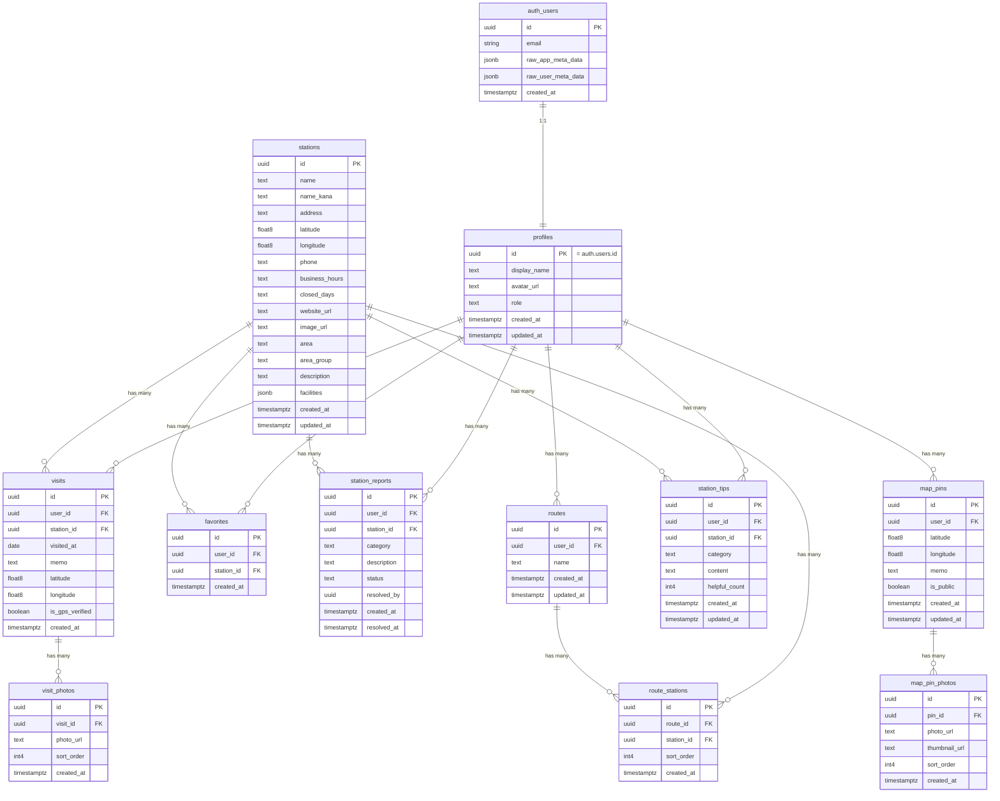

# データベース設計

> 北海道 道の駅コレクション - Supabase (PostgreSQL) データベース設計書

---

## 1. ER図



---

## 2. テーブル定義

### 2.1 stations（道の駅マスター）

道の駅の基本情報を管理するマスターテーブル。初期データはシードで約130件を投入する。

| カラム名 | 型 | NULL | デフォルト | 説明 |
|---------|-----|------|-----------|------|
| id | uuid | NO | `gen_random_uuid()` | 主キー |
| name | text | NO | | 道の駅名（例: 道の駅 あさひかわ） |
| name_kana | text | YES | | ふりがな（例: あさひかわ） |
| address | text | NO | | 住所 |
| latitude | float8 | NO | | 緯度（WGS84） |
| longitude | float8 | NO | | 経度（WGS84） |
| phone | text | YES | | 電話番号 |
| business_hours | text | YES | | 営業時間（自由記述） |
| closed_days | text | YES | | 定休日（自由記述） |
| website_url | text | YES | | 公式サイトURL |
| image_url | text | YES | | メイン画像URL |
| area | text | NO | | 振興局名（例: 上川総合振興局） |
| area_group | text | NO | | エリアグループ（道東/道北/道央/道南） |
| description | text | YES | | 説明文 |
| facilities | jsonb | YES | `'{}'::jsonb` | 設備情報（後述） |
| created_at | timestamptz | NO | `now()` | 作成日時 |
| updated_at | timestamptz | NO | `now()` | 更新日時 |

**制約**:
- `PRIMARY KEY (id)`
- `CHECK (area_group IN ('道東', '道北', '道央', '道南'))`
- `CHECK (latitude BETWEEN 41.0 AND 46.0)` -- 北海道の緯度範囲
- `CHECK (longitude BETWEEN 139.0 AND 146.0)` -- 北海道の経度範囲

**facilities JSONB 構造**:

```json
{
  "toilet": true,
  "parking": 150,
  "ev_charger": false,
  "wifi": true,
  "restaurant": true,
  "shop": true,
  "baby_room": false,
  "handicap_toilet": true,
  "atm": false,
  "information": true
}
```

| キー | 型 | 説明 |
|------|-----|------|
| `toilet` | boolean | トイレ |
| `parking` | number \| null | 駐車台数（null = 不明） |
| `ev_charger` | boolean | EV充電スタンド |
| `wifi` | boolean | Wi-Fi |
| `restaurant` | boolean | レストラン・食堂 |
| `shop` | boolean | 売店 |
| `baby_room` | boolean | 授乳室・ベビールーム |
| `handicap_toilet` | boolean | バリアフリートイレ |
| `atm` | boolean | ATM |
| `information` | boolean | 観光案内所 |

---

### 2.2 profiles（ユーザープロフィール）

Supabase Auth の `auth.users` と 1:1 で紐づくプロフィールテーブル。ユーザー登録時に自動作成する（Supabase の Database Function + Trigger）。

| カラム名 | 型 | NULL | デフォルト | 説明 |
|---------|-----|------|-----------|------|
| id | uuid | NO | | 主キー（= auth.users.id） |
| display_name | text | YES | | 表示名 |
| avatar_url | text | YES | | アバター画像URL |
| role | text | NO | `'user'` | ユーザー権限（user / admin） |
| created_at | timestamptz | NO | `now()` | 作成日時 |
| updated_at | timestamptz | NO | `now()` | 更新日時 |

**制約**:
- `PRIMARY KEY (id)`
- `FOREIGN KEY (id) REFERENCES auth.users(id) ON DELETE CASCADE`
- `CHECK (role IN ('user', 'admin'))`

**自動作成トリガー**:

```sql
-- ユーザー登録時に profiles レコードを自動作成する関数
CREATE OR REPLACE FUNCTION public.handle_new_user()
RETURNS trigger
LANGUAGE plpgsql
SECURITY DEFINER
SET search_path = ''
AS $$
BEGIN
  INSERT INTO public.profiles (id, display_name, avatar_url)
  VALUES (
    NEW.id,
    COALESCE(NEW.raw_user_meta_data ->> 'full_name', NEW.raw_user_meta_data ->> 'name', ''),
    COALESCE(NEW.raw_user_meta_data ->> 'avatar_url', NEW.raw_user_meta_data ->> 'picture', '')
  );
  RETURN NEW;
END;
$$;

-- auth.users への INSERT をトリガーに profiles を作成
CREATE TRIGGER on_auth_user_created
  AFTER INSERT ON auth.users
  FOR EACH ROW
  EXECUTE FUNCTION public.handle_new_user();
```

---

### 2.3 visits（訪問記録）

ユーザーの道の駅訪問記録。**同一道の駅への複数回訪問を許可する**（ユニーク制約なし）。再訪問は履歴として記録される。初回訪問でスタンプ（バッジ）を獲得し、達成率は `COUNT(DISTINCT station_id)` で計算する。

| カラム名 | 型 | NULL | デフォルト | 説明 |
|---------|-----|------|-----------|------|
| id | uuid | NO | `gen_random_uuid()` | 主キー |
| user_id | uuid | NO | | ユーザーID |
| station_id | uuid | NO | | 道の駅ID |
| visited_at | date | NO | `CURRENT_DATE` | 訪問日 |
| memo | text | YES | | メモ（自由記述） |
| latitude | float8 | YES | | 訪問時のGPS緯度 |
| longitude | float8 | YES | | 訪問時のGPS経度 |
| is_gps_verified | boolean | NO | `false` | GPS位置認証済みか（道の駅から半径1km以内ならtrue） |
| created_at | timestamptz | NO | `now()` | 作成日時 |

**制約**:
- `PRIMARY KEY (id)`
- `FOREIGN KEY (user_id) REFERENCES profiles(id) ON DELETE CASCADE`
- `FOREIGN KEY (station_id) REFERENCES stations(id) ON DELETE RESTRICT`

**ユニーク制約なし（設計判断）**:

- 同一ユーザーが同一道の駅を複数回訪問できる
- 各訪問は独立した履歴レコードとして保存される
- 達成率（スタンプラリー進捗）は以下のクエリで算出する:

```sql
-- ユーザーの達成率を計算
SELECT COUNT(DISTINCT station_id) AS visited_count
FROM visits
WHERE user_id = :user_id;

-- 達成率 = visited_count / 全道の駅数（約130）
```

**バッジ判定ロジック**:

- ゴールドバッジ: `is_gps_verified = true` の訪問記録が存在
- シルバーバッジ: `is_gps_verified = false` の訪問記録のみ存在
- 同一道の駅に複数回訪問した場合、一度でもゴールドがあればゴールド表示

```sql
-- ユーザーの道の駅別バッジ種別を取得
SELECT
  station_id,
  BOOL_OR(is_gps_verified) AS has_gold_badge
FROM visits
WHERE user_id = :user_id
GROUP BY station_id;
```

---

### 2.4 favorites（お気に入り）

ユーザーが「巡りたいリスト」に登録した道の駅。

| カラム名 | 型 | NULL | デフォルト | 説明 |
|---------|-----|------|-----------|------|
| id | uuid | NO | `gen_random_uuid()` | 主キー |
| user_id | uuid | NO | | ユーザーID |
| station_id | uuid | NO | | 道の駅ID |
| created_at | timestamptz | NO | `now()` | 作成日時 |

**制約**:
- `PRIMARY KEY (id)`
- `FOREIGN KEY (user_id) REFERENCES profiles(id) ON DELETE CASCADE`
- `FOREIGN KEY (station_id) REFERENCES stations(id) ON DELETE RESTRICT`
- `UNIQUE (user_id, station_id)` -- 同一道の駅への重複登録を防止

---

### 2.5 map_pins（マップピン）

ログインユーザーが地図上に置く写真+メモの記録。デフォルト公開で、投稿者が非公開に切り替え可能。

| カラム名 | 型 | NULL | デフォルト | 説明 |
|---------|-----|------|-----------|------|
| id | uuid | NO | `gen_random_uuid()` | 主キー |
| user_id | uuid | NO | | 投稿者ユーザーID |
| latitude | float8 | NO | | 緯度（WGS84） |
| longitude | float8 | NO | | 経度（WGS84） |
| memo | text | YES | | 一言メモ（最大200文字、アプリ層バリデーション） |
| is_public | boolean | NO | `true` | 公開フラグ（true=公開、false=非公開） |
| created_at | timestamptz | NO | `now()` | 作成日時 |
| updated_at | timestamptz | NO | `now()` | 更新日時 |

**制約**:
- `PRIMARY KEY (id)`
- `FOREIGN KEY (user_id) REFERENCES profiles(id) ON DELETE CASCADE`
- `CHECK (latitude BETWEEN 40.5 AND 46.5)` -- 北海道の地図表示範囲
- `CHECK (longitude BETWEEN 138.0 AND 147.5)` -- 北海道の地図表示範囲

---

### 2.6 map_pin_photos（マップピン写真）

マップピンに添付する写真。将来の複数枚対応用に別テーブルに分離（UIは一旦1枚のみ）。

| カラム名 | 型 | NULL | デフォルト | 説明 |
|---------|-----|------|-----------|------|
| id | uuid | NO | `gen_random_uuid()` | 主キー |
| pin_id | uuid | NO | | ピンID |
| photo_url | text | NO | | 表示用画像URL（Supabase Storage） |
| thumbnail_url | text | NO | | サムネイル画像URL |
| sort_order | int4 | NO | `0` | 表示順（将来の複数枚対応用） |
| created_at | timestamptz | NO | `now()` | 作成日時 |

**制約**:
- `PRIMARY KEY (id)`
- `FOREIGN KEY (pin_id) REFERENCES map_pins(id) ON DELETE CASCADE`

**Storage**:
- バケット名: `map-pin-photos`（public）
- パス構造: `{user_id}/{filename}`
- 画像バリデーション: JPEG / PNG / WebP、最大5MB
- リサイズ: 表示用（長辺1200px, 80%）、サムネイル用（長辺200px, 70%）

---

### 2.8 visit_photos（訪問写真）-- Phase 2

訪問記録に添付する写真。1回の訪問につき最大3枚まで。

| カラム名 | 型 | NULL | デフォルト | 説明 |
|---------|-----|------|-----------|------|
| id | uuid | NO | `gen_random_uuid()` | 主キー |
| visit_id | uuid | NO | | 訪問記録ID |
| photo_url | text | NO | | 画像URL（Supabase Storage） |
| sort_order | int4 | NO | `0` | 表示順序（0始まり） |
| created_at | timestamptz | NO | `now()` | 作成日時 |

**制約**:
- `PRIMARY KEY (id)`
- `FOREIGN KEY (visit_id) REFERENCES visits(id) ON DELETE CASCADE`
- `CHECK (sort_order BETWEEN 0 AND 2)` -- 最大3枚（0, 1, 2）

---

### 2.9 station_reports（情報修正リクエスト）-- Phase 2

ユーザーからの道の駅情報修正リクエスト。管理者が承認/却下する。

| カラム名 | 型 | NULL | デフォルト | 説明 |
|---------|-----|------|-----------|------|
| id | uuid | NO | `gen_random_uuid()` | 主キー |
| user_id | uuid | NO | | 報告者のユーザーID |
| station_id | uuid | NO | | 対象の道の駅ID |
| category | text | NO | | 修正対象カテゴリ |
| description | text | NO | | 修正内容の説明 |
| status | text | NO | `'pending'` | ステータス |
| resolved_by | uuid | YES | | 対応した管理者のユーザーID |
| created_at | timestamptz | NO | `now()` | 作成日時 |
| resolved_at | timestamptz | YES | | 対応日時 |

**制約**:
- `PRIMARY KEY (id)`
- `FOREIGN KEY (user_id) REFERENCES profiles(id) ON DELETE CASCADE`
- `FOREIGN KEY (station_id) REFERENCES stations(id) ON DELETE RESTRICT`
- `FOREIGN KEY (resolved_by) REFERENCES profiles(id) ON DELETE SET NULL`
- `CHECK (category IN ('business_hours', 'closed_days', 'phone', 'facilities', 'other'))`
- `CHECK (status IN ('pending', 'approved', 'rejected'))`

---

### 2.10 routes（ルート計画）-- Phase 2

ユーザーが作成するドライブルート計画。お気に入りリストから道の駅を選択して巡回ルートを組む。

| カラム名 | 型 | NULL | デフォルト | 説明 |
|---------|-----|------|-----------|------|
| id | uuid | NO | `gen_random_uuid()` | 主キー |
| user_id | uuid | NO | | ユーザーID |
| name | text | NO | | ルート名 |
| created_at | timestamptz | NO | `now()` | 作成日時 |
| updated_at | timestamptz | NO | `now()` | 更新日時 |

**制約**:
- `PRIMARY KEY (id)`
- `FOREIGN KEY (user_id) REFERENCES profiles(id) ON DELETE CASCADE`

---

### 2.11 route_stations（ルート内の道の駅）-- Phase 2

ルート計画に含まれる道の駅と巡回順序。

| カラム名 | 型 | NULL | デフォルト | 説明 |
|---------|-----|------|-----------|------|
| id | uuid | NO | `gen_random_uuid()` | 主キー |
| route_id | uuid | NO | | ルート計画ID |
| station_id | uuid | NO | | 道の駅ID |
| sort_order | int4 | NO | | 巡回順序 |
| created_at | timestamptz | NO | `now()` | 作成日時 |

**制約**:
- `PRIMARY KEY (id)`
- `FOREIGN KEY (route_id) REFERENCES routes(id) ON DELETE CASCADE`
- `FOREIGN KEY (station_id) REFERENCES stations(id) ON DELETE RESTRICT`
- `UNIQUE (route_id, sort_order)` -- 同一ルート内の順序重複を防止

---

### 2.12 station_tips（道の駅Tips）-- Phase 3

スタンプラリー特化の構造化レビュー。カテゴリ別にTipsを投稿できる。

| カラム名 | 型 | NULL | デフォルト | 説明 |
|---------|-----|------|-----------|------|
| id | uuid | NO | `gen_random_uuid()` | 主キー |
| user_id | uuid | NO | | 投稿者のユーザーID |
| station_id | uuid | NO | | 対象の道の駅ID |
| category | text | NO | | Tipsカテゴリ |
| content | text | NO | | Tips本文 |
| helpful_count | int4 | NO | `0` | 「参考になった」数 |
| created_at | timestamptz | NO | `now()` | 作成日時 |
| updated_at | timestamptz | NO | `now()` | 更新日時 |

**制約**:
- `PRIMARY KEY (id)`
- `FOREIGN KEY (user_id) REFERENCES profiles(id) ON DELETE CASCADE`
- `FOREIGN KEY (station_id) REFERENCES stations(id) ON DELETE RESTRICT`
- `CHECK (category IN ('gourmet', 'parking', 'stamp', 'photo_spot', 'caution'))`
- `CHECK (helpful_count >= 0)`

---

## 3. インデックス設計

### 3.1 stations

| インデックス名 | カラム | 種類 | 想定クエリ |
|---------------|--------|------|-----------|
| `pk_stations` | id | PRIMARY | 道の駅詳細取得 |
| `idx_stations_area_group` | area_group | BTREE | エリアグループでのフィルタリング（道東/道北/道央/道南） |
| `idx_stations_area` | area | BTREE | 振興局でのフィルタリング（将来の詳細フィルタ用） |
| `idx_stations_name_search` | name | GIN (pg_trgm) | 道の駅名のあいまい検索 |
| `idx_stations_name_kana_search` | name_kana | GIN (pg_trgm) | ふりがなのあいまい検索 |
| `idx_stations_address_search` | address | GIN (pg_trgm) | 住所のあいまい検索 |
| `idx_stations_location` | latitude, longitude | BTREE | 座標での範囲検索（現在地周辺） |

```sql
-- エリアフィルタ用インデックス
CREATE INDEX idx_stations_area_group ON stations (area_group);
CREATE INDEX idx_stations_area ON stations (area);

-- 名前検索用（トライグラムインデックス）
CREATE EXTENSION IF NOT EXISTS pg_trgm;
CREATE INDEX idx_stations_name_search ON stations USING gin (name gin_trgm_ops);
CREATE INDEX idx_stations_name_kana_search ON stations USING gin (name_kana gin_trgm_ops);

-- 住所検索用（トライグラムインデックス）
CREATE INDEX idx_stations_address_search ON stations USING gin (address gin_trgm_ops);

-- 座標範囲検索用（複合インデックス）
CREATE INDEX idx_stations_location ON stations (latitude, longitude);
```

**注**: 約130件のマスターデータのため、インデックスの効果は限定的。ただし将来の全国展開（約1,200件以上）を見据えて設定しておく。

### 3.2 visits

| インデックス名 | カラム | 種類 | 想定クエリ |
|---------------|--------|------|-----------|
| `pk_visits` | id | PRIMARY | 訪問記録詳細取得 |
| `idx_visits_user_id` | user_id | BTREE | ユーザーの訪問記録一覧 |
| `idx_visits_user_station` | user_id, station_id | BTREE (複合) | ユーザーの道の駅別訪問チェック、達成率計算 |
| `idx_visits_user_visited_at` | user_id, visited_at DESC | BTREE (複合) | 訪問履歴の時系列表示 |
| `idx_visits_station_id` | station_id | BTREE | 道の駅の訪問数集計（ランキング用） |

```sql
-- ユーザーの訪問記録一覧
CREATE INDEX idx_visits_user_id ON visits (user_id);

-- 達成率計算: COUNT(DISTINCT station_id) WHERE user_id = ?
-- バッジ判定: BOOL_OR(is_gps_verified) GROUP BY station_id WHERE user_id = ?
CREATE INDEX idx_visits_user_station ON visits (user_id, station_id);

-- 訪問履歴の時系列表示（新しい順）
CREATE INDEX idx_visits_user_visited_at ON visits (user_id, visited_at DESC);

-- 道の駅別の訪問数集計（Phase 3 ランキング用）
CREATE INDEX idx_visits_station_id ON visits (station_id);
```

### 3.3 favorites

| インデックス名 | カラム | 種類 | 想定クエリ |
|---------------|--------|------|-----------|
| `pk_favorites` | id | PRIMARY | お気に入り詳細取得 |
| `uq_favorites_user_station` | user_id, station_id | UNIQUE | 重複防止 + 存在チェック |
| `idx_favorites_user_id` | user_id | BTREE | ユーザーのお気に入り一覧 |

```sql
-- ユニーク制約がインデックスを兼ねる
-- user_id, station_id の複合ユニーク制約で以下のクエリをカバー:
--   - ユーザーのお気に入り一覧（user_id が先頭カラム）
--   - 特定道の駅のお気に入り有無チェック

-- user_id 単体でのフィルタも複合ユニークインデックスでカバーされる
-- （複合インデックスの左端一致原則）
```

### 3.4 map_pins

| インデックス名 | カラム | 種類 | 想定クエリ |
|---------------|--------|------|-----------|
| `pk_map_pins` | id | PRIMARY | ピン詳細取得 |
| `idx_map_pins_user_id` | user_id | BTREE | ユーザーのピン一覧 |
| `idx_map_pins_is_public` | is_public | BTREE | 公開ピンのフィルタリング |

```sql
CREATE INDEX idx_map_pins_user_id ON map_pins (user_id);
CREATE INDEX idx_map_pins_is_public ON map_pins (is_public);
```

### 3.5 map_pin_photos

| インデックス名 | カラム | 種類 | 想定クエリ |
|---------------|--------|------|-----------|
| `pk_map_pin_photos` | id | PRIMARY | 写真詳細取得 |
| `idx_map_pin_photos_pin_id` | pin_id | BTREE | ピンの写真取得 |

```sql
CREATE INDEX idx_map_pin_photos_pin_id ON map_pin_photos (pin_id);
```

### 3.6 visit_photos（Phase 2）

| インデックス名 | カラム | 種類 | 想定クエリ |
|---------------|--------|------|-----------|
| `pk_visit_photos` | id | PRIMARY | 写真詳細取得 |
| `idx_visit_photos_visit_id` | visit_id | BTREE | 訪問記録の写真一覧 |

```sql
CREATE INDEX idx_visit_photos_visit_id ON visit_photos (visit_id, sort_order);
```

### 3.7 station_reports（Phase 2）

| インデックス名 | カラム | 種類 | 想定クエリ |
|---------------|--------|------|-----------|
| `pk_station_reports` | id | PRIMARY | リクエスト詳細取得 |
| `idx_station_reports_status` | status, created_at | BTREE (複合) | 管理者: 未処理リクエスト一覧 |
| `idx_station_reports_user_id` | user_id | BTREE | ユーザーの投稿リクエスト一覧 |
| `idx_station_reports_station_id` | station_id | BTREE | 道の駅別リクエスト一覧 |

```sql
-- 管理者が未処理（pending）のリクエストを新しい順に表示
CREATE INDEX idx_station_reports_status ON station_reports (status, created_at DESC);

CREATE INDEX idx_station_reports_user_id ON station_reports (user_id);
CREATE INDEX idx_station_reports_station_id ON station_reports (station_id);
```

### 3.8 routes / route_stations（Phase 2）

| インデックス名 | カラム | 種類 | 想定クエリ |
|---------------|--------|------|-----------|
| `pk_routes` | id | PRIMARY | ルート計画詳細取得 |
| `idx_routes_user_id` | user_id | BTREE | ユーザーのルート計画一覧 |
| `pk_route_stations` | id | PRIMARY | ルート内道の駅詳細取得 |
| `idx_route_stations_route_id` | route_id, sort_order | BTREE (複合) | ルート内の道の駅を順序付きで取得 |

```sql
CREATE INDEX idx_routes_user_id ON routes (user_id);
CREATE INDEX idx_route_stations_route_id ON route_stations (route_id, sort_order);
```

### 3.9 station_tips（Phase 3）

| インデックス名 | カラム | 種類 | 想定クエリ |
|---------------|--------|------|-----------|
| `pk_station_tips` | id | PRIMARY | Tips詳細取得 |
| `idx_station_tips_station_category` | station_id, category | BTREE (複合) | 道の駅詳細ページでのカテゴリ別Tips表示 |
| `idx_station_tips_user_id` | user_id | BTREE | ユーザーの投稿Tips一覧 |
| `idx_station_tips_helpful` | station_id, helpful_count DESC | BTREE (複合) | 「参考になった」順の並び替え |

```sql
CREATE INDEX idx_station_tips_station_category ON station_tips (station_id, category);
CREATE INDEX idx_station_tips_user_id ON station_tips (user_id);
CREATE INDEX idx_station_tips_helpful ON station_tips (station_id, helpful_count DESC);
```

---

## 4. RLSポリシー詳細

### 4.1 RLS 有効化

```sql
-- 全テーブルで RLS を有効化
ALTER TABLE stations ENABLE ROW LEVEL SECURITY;
ALTER TABLE profiles ENABLE ROW LEVEL SECURITY;
ALTER TABLE visits ENABLE ROW LEVEL SECURITY;
ALTER TABLE favorites ENABLE ROW LEVEL SECURITY;
ALTER TABLE map_pins ENABLE ROW LEVEL SECURITY;
ALTER TABLE map_pin_photos ENABLE ROW LEVEL SECURITY;
ALTER TABLE visit_photos ENABLE ROW LEVEL SECURITY;
ALTER TABLE station_reports ENABLE ROW LEVEL SECURITY;
ALTER TABLE routes ENABLE ROW LEVEL SECURITY;
ALTER TABLE route_stations ENABLE ROW LEVEL SECURITY;
ALTER TABLE station_tips ENABLE ROW LEVEL SECURITY;
```

### 4.2 管理者判定ヘルパー関数

profiles テーブルの `role` カラムで管理者を判定する。

```sql
-- 現在のユーザーが管理者かどうかを返す関数
CREATE OR REPLACE FUNCTION public.is_admin()
RETURNS boolean
LANGUAGE sql
STABLE
SECURITY DEFINER
SET search_path = ''
AS $$
  SELECT EXISTS (
    SELECT 1
    FROM public.profiles
    WHERE id = auth.uid()
      AND role = 'admin'
  );
$$;
```

### 4.3 stations テーブルのポリシー

| 操作 | ポリシー | 条件 |
|------|---------|------|
| SELECT | 全ユーザー（未ログイン含む） | 無条件 |
| INSERT | 管理者のみ | `is_admin()` |
| UPDATE | 管理者のみ | `is_admin()` |
| DELETE | 管理者のみ | `is_admin()` |

```sql
-- SELECT: 誰でも閲覧可能（SSG/ISR でも取得可能にするため anon ロールにも許可）
CREATE POLICY "stations_select_all"
  ON stations FOR SELECT
  TO anon, authenticated
  USING (true);

-- INSERT: 管理者のみ
CREATE POLICY "stations_insert_admin"
  ON stations FOR INSERT
  TO authenticated
  WITH CHECK (public.is_admin());

-- UPDATE: 管理者のみ
CREATE POLICY "stations_update_admin"
  ON stations FOR UPDATE
  TO authenticated
  USING (public.is_admin())
  WITH CHECK (public.is_admin());

-- DELETE: 管理者のみ
CREATE POLICY "stations_delete_admin"
  ON stations FOR DELETE
  TO authenticated
  USING (public.is_admin());
```

### 4.4 profiles テーブルのポリシー

| 操作 | ポリシー | 条件 |
|------|---------|------|
| SELECT | 本人のみ | `auth.uid() = id` |
| INSERT | 認証ユーザー（トリガーで自動作成） | `auth.uid() = id` |
| UPDATE | 本人のみ | `auth.uid() = id` |
| DELETE | 不可 | -- |

```sql
-- SELECT: 本人のみ自分のプロフィールを取得
CREATE POLICY "profiles_select_own"
  ON profiles FOR SELECT
  TO authenticated
  USING (auth.uid() = id);

-- INSERT: 本人のみ（トリガーで自動作成、手動作成時の安全策）
CREATE POLICY "profiles_insert_own"
  ON profiles FOR INSERT
  TO authenticated
  WITH CHECK (auth.uid() = id);

-- UPDATE: 本人のみ（display_name, avatar_url の変更）
CREATE POLICY "profiles_update_own"
  ON profiles FOR UPDATE
  TO authenticated
  USING (auth.uid() = id)
  WITH CHECK (auth.uid() = id);

-- DELETE: 不可（auth.users 削除時に CASCADE で自動削除）
-- ポリシーなし = 削除不可
```

**必須: セキュリティ上、トリガーで role 変更を防止**

プロフィールの `role` カラムは RLS ポリシーの UPDATE で変更可能になるため、アプリケーション側で `role` フィールドの更新をバリデーション（Zod で除外）する。加えて、Supabase クライアントライブラリを直接使ったリクエストで role を変更されるリスクがあるため、以下のトリガーを必須マイグレーションとして設置する。

```sql
-- role カラムの直接変更を防止するトリガー（必須）
CREATE OR REPLACE FUNCTION public.prevent_role_change()
RETURNS trigger
LANGUAGE plpgsql
AS $$
BEGIN
  IF NEW.role IS DISTINCT FROM OLD.role THEN
    -- 管理者が変更する場合は許可（Supabase の service_role 経由）
    IF NOT public.is_admin() THEN
      NEW.role := OLD.role;
    END IF;
  END IF;
  RETURN NEW;
END;
$$;

CREATE TRIGGER on_profile_update_prevent_role_change
  BEFORE UPDATE ON profiles
  FOR EACH ROW
  EXECUTE FUNCTION public.prevent_role_change();
```

### 4.5 visits テーブルのポリシー

| 操作 | ポリシー | 条件 |
|------|---------|------|
| SELECT | 本人のみ | `auth.uid() = user_id` |
| INSERT | 認証ユーザー（自分のレコードのみ） | `auth.uid() = user_id` |
| UPDATE | 本人のみ | `auth.uid() = user_id` |
| DELETE | 本人のみ | `auth.uid() = user_id` |

```sql
-- SELECT: 本人のみ
CREATE POLICY "visits_select_own"
  ON visits FOR SELECT
  TO authenticated
  USING (auth.uid() = user_id);

-- INSERT: 認証ユーザーが自分の訪問記録を作成
CREATE POLICY "visits_insert_own"
  ON visits FOR INSERT
  TO authenticated
  WITH CHECK (auth.uid() = user_id);

-- UPDATE: 本人のみ（メモの編集等）
CREATE POLICY "visits_update_own"
  ON visits FOR UPDATE
  TO authenticated
  USING (auth.uid() = user_id)
  WITH CHECK (auth.uid() = user_id);

-- DELETE: 本人のみ
CREATE POLICY "visits_delete_own"
  ON visits FOR DELETE
  TO authenticated
  USING (auth.uid() = user_id);
```

### 4.6 favorites テーブルのポリシー

| 操作 | ポリシー | 条件 |
|------|---------|------|
| SELECT | 本人のみ | `auth.uid() = user_id` |
| INSERT | 認証ユーザー（自分のレコードのみ） | `auth.uid() = user_id` |
| UPDATE | 不可 | -- |
| DELETE | 本人のみ | `auth.uid() = user_id` |

```sql
-- SELECT: 本人のみ
CREATE POLICY "favorites_select_own"
  ON favorites FOR SELECT
  TO authenticated
  USING (auth.uid() = user_id);

-- INSERT: 認証ユーザーが自分のお気に入りを追加
CREATE POLICY "favorites_insert_own"
  ON favorites FOR INSERT
  TO authenticated
  WITH CHECK (auth.uid() = user_id);

-- UPDATE: 不可（ポリシーなし）
-- お気に入りは追加/削除のみ。更新する属性がない。

-- DELETE: 本人のみ
CREATE POLICY "favorites_delete_own"
  ON favorites FOR DELETE
  TO authenticated
  USING (auth.uid() = user_id);
```

### 4.7 visit_photos テーブルのポリシー（Phase 2）

| 操作 | ポリシー | 条件 |
|------|---------|------|
| SELECT | 写真が紐づく訪問記録の本人のみ | 訪問記録の `user_id` をチェック |
| INSERT | 認証ユーザー（自分の訪問記録への添付のみ） | 訪問記録の `user_id` をチェック |
| UPDATE | 不可 | -- |
| DELETE | 本人のみ | 訪問記録の `user_id` をチェック |

```sql
-- SELECT: 訪問記録の所有者のみ
CREATE POLICY "visit_photos_select_own"
  ON visit_photos FOR SELECT
  TO authenticated
  USING (
    EXISTS (
      SELECT 1 FROM visits
      WHERE visits.id = visit_photos.visit_id
        AND visits.user_id = auth.uid()
    )
  );

-- INSERT: 自分の訪問記録への写真添付のみ
CREATE POLICY "visit_photos_insert_own"
  ON visit_photos FOR INSERT
  TO authenticated
  WITH CHECK (
    EXISTS (
      SELECT 1 FROM visits
      WHERE visits.id = visit_photos.visit_id
        AND visits.user_id = auth.uid()
    )
  );

-- DELETE: 自分の訪問記録の写真のみ
CREATE POLICY "visit_photos_delete_own"
  ON visit_photos FOR DELETE
  TO authenticated
  USING (
    EXISTS (
      SELECT 1 FROM visits
      WHERE visits.id = visit_photos.visit_id
        AND visits.user_id = auth.uid()
    )
  );
```

### 4.8 station_reports テーブルのポリシー（Phase 2）

| 操作 | ポリシー | 条件 |
|------|---------|------|
| SELECT | 本人 + 管理者 | `auth.uid() = user_id OR is_admin()` |
| INSERT | 認証ユーザー（自分のレコードのみ） | `auth.uid() = user_id` |
| UPDATE | 管理者のみ（ステータス変更） | `is_admin()` |
| DELETE | 管理者のみ | `is_admin()` |

```sql
-- SELECT: 本人のリクエスト + 管理者は全件閲覧
CREATE POLICY "station_reports_select_own_or_admin"
  ON station_reports FOR SELECT
  TO authenticated
  USING (auth.uid() = user_id OR public.is_admin());

-- INSERT: 認証ユーザーが自分のリクエストを作成
CREATE POLICY "station_reports_insert_own"
  ON station_reports FOR INSERT
  TO authenticated
  WITH CHECK (auth.uid() = user_id);

-- UPDATE: 管理者のみ（ステータスの承認/却下）
CREATE POLICY "station_reports_update_admin"
  ON station_reports FOR UPDATE
  TO authenticated
  USING (public.is_admin())
  WITH CHECK (public.is_admin());

-- DELETE: 管理者のみ
CREATE POLICY "station_reports_delete_admin"
  ON station_reports FOR DELETE
  TO authenticated
  USING (public.is_admin());
```

### 4.9 routes テーブルのポリシー（Phase 2）

| 操作 | ポリシー | 条件 |
|------|---------|------|
| SELECT | 本人のみ | `auth.uid() = user_id` |
| INSERT | 認証ユーザー（自分のレコードのみ） | `auth.uid() = user_id` |
| UPDATE | 本人のみ | `auth.uid() = user_id` |
| DELETE | 本人のみ | `auth.uid() = user_id` |

```sql
-- SELECT: 本人のみ
CREATE POLICY "routes_select_own"
  ON routes FOR SELECT
  TO authenticated
  USING (auth.uid() = user_id);

-- INSERT: 認証ユーザーが自分のルートを作成
CREATE POLICY "routes_insert_own"
  ON routes FOR INSERT
  TO authenticated
  WITH CHECK (auth.uid() = user_id);

-- UPDATE: 本人のみ（ルート名の変更等）
CREATE POLICY "routes_update_own"
  ON routes FOR UPDATE
  TO authenticated
  USING (auth.uid() = user_id)
  WITH CHECK (auth.uid() = user_id);

-- DELETE: 本人のみ
CREATE POLICY "routes_delete_own"
  ON routes FOR DELETE
  TO authenticated
  USING (auth.uid() = user_id);
```

### 4.10 route_stations テーブルのポリシー（Phase 2）

route_stations のアクセス制御は、親テーブル routes の所有者を経由して判定する。

| 操作 | ポリシー | 条件 |
|------|---------|------|
| SELECT | ルート所有者のみ | routes 経由で `user_id` をチェック |
| INSERT | ルート所有者のみ | routes 経由で `user_id` をチェック |
| UPDATE | ルート所有者のみ | routes 経由で `user_id` をチェック |
| DELETE | ルート所有者のみ | routes 経由で `user_id` をチェック |

```sql
-- SELECT: ルートの所有者のみ
CREATE POLICY "route_stations_select_own"
  ON route_stations FOR SELECT
  TO authenticated
  USING (
    EXISTS (
      SELECT 1 FROM routes
      WHERE routes.id = route_stations.route_id
        AND routes.user_id = auth.uid()
    )
  );

-- INSERT: 自分のルートへの道の駅追加のみ
CREATE POLICY "route_stations_insert_own"
  ON route_stations FOR INSERT
  TO authenticated
  WITH CHECK (
    EXISTS (
      SELECT 1 FROM routes
      WHERE routes.id = route_stations.route_id
        AND routes.user_id = auth.uid()
    )
  );

-- UPDATE: 自分のルート内の道の駅のみ（順序変更等）
CREATE POLICY "route_stations_update_own"
  ON route_stations FOR UPDATE
  TO authenticated
  USING (
    EXISTS (
      SELECT 1 FROM routes
      WHERE routes.id = route_stations.route_id
        AND routes.user_id = auth.uid()
    )
  )
  WITH CHECK (
    EXISTS (
      SELECT 1 FROM routes
      WHERE routes.id = route_stations.route_id
        AND routes.user_id = auth.uid()
    )
  );

-- DELETE: 自分のルート内の道の駅のみ
CREATE POLICY "route_stations_delete_own"
  ON route_stations FOR DELETE
  TO authenticated
  USING (
    EXISTS (
      SELECT 1 FROM routes
      WHERE routes.id = route_stations.route_id
        AND routes.user_id = auth.uid()
    )
  );
```

### 4.11 station_tips テーブルのポリシー（Phase 3）

| 操作 | ポリシー | 条件 |
|------|---------|------|
| SELECT | 全ユーザー（未ログイン含む） | 無条件 |
| INSERT | 認証ユーザー（自分のレコードのみ） | `auth.uid() = user_id` |
| UPDATE | 本人のみ | `auth.uid() = user_id` |
| DELETE | 本人のみ | `auth.uid() = user_id` |

```sql
-- SELECT: 誰でも閲覧可能（道の駅詳細ページで表示）
CREATE POLICY "station_tips_select_all"
  ON station_tips FOR SELECT
  TO anon, authenticated
  USING (true);

-- INSERT: 認証ユーザーが自分のTipsを投稿
CREATE POLICY "station_tips_insert_own"
  ON station_tips FOR INSERT
  TO authenticated
  WITH CHECK (auth.uid() = user_id);

-- UPDATE: 本人のみ（Tips本文の編集）
CREATE POLICY "station_tips_update_own"
  ON station_tips FOR UPDATE
  TO authenticated
  USING (auth.uid() = user_id)
  WITH CHECK (auth.uid() = user_id);

-- DELETE: 本人のみ
CREATE POLICY "station_tips_delete_own"
  ON station_tips FOR DELETE
  TO authenticated
  USING (auth.uid() = user_id);
```

---

## 5. シードデータ

### 5.1 stations テーブルの初期データ投入方針

- **データソース**: 国土交通省の道の駅オープンデータ、および各道の駅の公式サイト
- **投入方法**: Supabase の migration ファイル（SQL INSERT）またはシードスクリプト（TypeScript）
- **投入件数**: 北海道の道の駅 約130件
- **更新頻度**: 新規登録・廃止時に管理者が管理画面から追加/更新

### 5.2 area_group（エリアグループ）と振興局のマッピング

UIでは4つのエリアグループで表示し、DBには振興局名も保持する。

| area_group | area（振興局名） | 道の駅数（目安） |
|-----------|-----------------|---------------|
| 道東 | オホーツク総合振興局 | 約20 |
| 道東 | 十勝総合振興局 | 約15 |
| 道東 | 釧路総合振興局 | 約10 |
| 道東 | 根室振興局 | 約5 |
| 道北 | 上川総合振興局 | 約15 |
| 道北 | 宗谷総合振興局 | 約10 |
| 道北 | 留萌振興局 | 約5 |
| 道央 | 石狩振興局 | 約5 |
| 道央 | 空知総合振興局 | 約15 |
| 道央 | 後志総合振興局 | 約10 |
| 道央 | 胆振総合振興局 | 約5 |
| 道央 | 日高振興局 | 約5 |
| 道南 | 渡島総合振興局 | 約5 |
| 道南 | 檜山振興局 | 約5 |

### 5.3 シードデータ例

```sql
-- シードデータの例（一部抜粋）
INSERT INTO stations (name, name_kana, address, latitude, longitude, phone, business_hours, closed_days, website_url, area, area_group, description, facilities)
VALUES
  (
    '道の駅 あさひかわ',
    'あさひかわ',
    '北海道旭川市神楽4条6丁目1-12',
    43.7558,
    142.3700,
    '0166-61-2283',
    '9:00〜21:00',
    '年末年始',
    'https://www.hokkaido-michinoeki.jp/michinoeki/2429.html',
    '上川総合振興局',
    '道北',
    '旭川市中心部に位置する都市型道の駅。地元の特産品やグルメが充実。',
    '{"toilet": true, "parking": 150, "ev_charger": false, "wifi": true, "restaurant": true, "shop": true, "baby_room": true, "handicap_toilet": true, "atm": false, "information": true}'::jsonb
  ),
  (
    '道の駅 おびら鰊番屋',
    'おびらにしんばんや',
    '北海道留萌郡小平町字鬼鹿広富',
    44.0567,
    141.6789,
    '0164-57-1411',
    '9:00〜17:00（季節変動あり）',
    '月曜日（祝日の場合は翌日）',
    'https://www.hokkaido-michinoeki.jp/michinoeki/2522.html',
    '留萌振興局',
    '道北',
    '旧花田家番屋（国指定重要文化財）に隣接する道の駅。',
    '{"toilet": true, "parking": 80, "ev_charger": false, "wifi": false, "restaurant": true, "shop": true, "baby_room": false, "handicap_toilet": false, "atm": false, "information": true}'::jsonb
  );

-- 残りの約128件は migration ファイルまたはシードスクリプトで投入
```

### 5.4 シードスクリプト方針

- `supabase/seed.sql` にシードデータを記述する
- または `scripts/seed-stations.ts` として TypeScript スクリプトを用意し、CSVやJSONから投入する
- 本番環境では `supabase db seed` コマンドで実行

---

## 6. マイグレーション方針

### 6.1 マイグレーション管理方法

Supabase CLI のマイグレーション機能を使用する。

```bash
# マイグレーションファイルの作成
supabase migration new <migration_name>

# ローカルでマイグレーション実行
supabase db reset          # ローカルDBをリセットして全マイグレーション再実行
supabase migration up      # 未適用のマイグレーションを実行

# 本番環境への適用
supabase db push           # リモートDBにマイグレーションを適用
```

マイグレーションファイルは `supabase/migrations/` ディレクトリに配置される。

```
supabase/
├── config.toml
├── seed.sql
└── migrations/
    ├── 20260209000001_create_stations.sql
    ├── 20260209000002_create_profiles.sql
    ├── 20260209000003_create_visits.sql
    ├── 20260209000004_create_favorites.sql
    ├── 20260209000005_create_rls_policies.sql
    ├── 20260209000006_create_indexes.sql
    ├── 20260209000007_create_functions_triggers.sql
    ├── 20260209000008_create_prevent_role_change_trigger.sql
    └── ... (Phase 2, 3 で追加)
```

### 6.2 Phase 別マイグレーション順序

#### Phase 1（MVP）

| 順序 | マイグレーション名 | 内容 |
|------|------------------|------|
| 1 | `create_stations` | stations テーブル作成 |
| 2 | `create_profiles` | profiles テーブル + auth.users 連携トリガー |
| 3 | `create_visits` | visits テーブル作成 |
| 4 | `create_favorites` | favorites テーブル作成 |
| 5 | `create_rls_policies_phase1` | Phase 1 テーブルの RLS ポリシー |
| 6 | `create_indexes_phase1` | Phase 1 テーブルのインデックス |
| 7 | `create_functions_triggers` | is_admin() 関数、handle_new_user() トリガー等 |
| 8 | `create_prevent_role_change_trigger` | role 変更防止トリガー（セキュリティ必須） |
| 9 | `seed_stations` | 道の駅マスターデータ投入（seed.sql と分離も可） |

#### Phase 2（エンゲージメント強化）

| 順序 | マイグレーション名 | 内容 |
|------|------------------|------|
| 10 | `create_visit_photos` | visit_photos テーブル作成 |
| 11 | `create_station_reports` | station_reports テーブル作成 |
| 12 | `create_routes` | routes, route_stations テーブル作成 |
| 13 | `create_rls_policies_phase2` | Phase 2 テーブルの RLS ポリシー |
| 14 | `create_indexes_phase2` | Phase 2 テーブルのインデックス |

#### Phase 3（拡張機能）

| 順序 | マイグレーション名 | 内容 |
|------|------------------|------|
| 15 | `create_station_tips` | station_tips テーブル作成 |
| 16 | `create_rls_policies_phase3` | Phase 3 テーブルの RLS ポリシー |
| 17 | `create_indexes_phase3` | Phase 3 テーブルのインデックス |

### 6.3 マイグレーション運用ルール

- マイグレーションファイルは一度適用したら**編集しない**（新しいマイグレーションで変更する）
- 破壊的変更（カラム削除、型変更等）は段階的に行う（新カラム追加 → データ移行 → 旧カラム削除）
- ローカル開発では `supabase db reset` で全マイグレーションを再適用して検証する
- 本番適用前にステージング環境で検証する

---

## 7. 命名規則

### 7.1 テーブル命名規則

| 対象 | 規則 | 例 |
|------|------|-----|
| テーブル名 | スネークケース、複数形 | `stations`, `visits`, `station_tips` |
| 中間テーブル | `{テーブル1}_{テーブル2}` | `visit_photos`, `route_stations` |

### 7.2 カラム命名規則

| 対象 | 規則 | 例 |
|------|------|-----|
| 主キー | `id`（uuid） | `id` |
| 外部キー | `{テーブル名単数}_id` | `user_id`, `station_id`, `visit_id`, `route_id` |
| 日時 | `*_at`（timestamptz） | `created_at`, `updated_at`, `visited_at`, `resolved_at` |
| 日付（時刻なし） | `*_at` or `*_on`（date） | `visited_at`（date型） |
| フラグ | `is_*`（boolean） | `is_gps_verified` |
| カウント | `*_count`（int4） | `helpful_count` |
| URL | `*_url`（text） | `website_url`, `image_url`, `photo_url`, `avatar_url` |
| 自由記述テキスト | text型 | `name`, `address`, `memo`, `description`, `content` |
| 列挙値 | text型 + CHECK制約 | `role`, `status`, `category`, `area_group` |
| JSON構造 | jsonb型 | `facilities` |
| 座標 | float8型 | `latitude`, `longitude` |

### 7.3 インデックス命名規則

| 種類 | 規則 | 例 |
|------|------|-----|
| 主キー | `pk_{テーブル名}` | `pk_stations` |
| ユニーク | `uq_{テーブル名}_{カラム名}` | `uq_favorites_user_station` |
| 通常 | `idx_{テーブル名}_{カラム名}` | `idx_visits_user_id` |
| 複合 | `idx_{テーブル名}_{カラム1}_{カラム2}` | `idx_visits_user_station` |

### 7.4 RLSポリシー命名規則

```
{テーブル名}_{操作}_{対象}
```

例:
- `stations_select_all` -- 全ユーザー閲覧可
- `visits_insert_own` -- 本人のみ作成可
- `station_reports_select_own_or_admin` -- 本人 + 管理者閲覧可

### 7.5 関数・トリガー命名規則

| 種類 | 規則 | 例 |
|------|------|-----|
| 関数 | 動詞始まり、スネークケース | `handle_new_user()`, `is_admin()`, `prevent_role_change()` |
| トリガー | `on_{テーブル名}_{イベント}` | `on_auth_user_created`, `on_profile_update_prevent_role_change` |

---

## 8. 想定クエリパターン

参考として、主要な画面で使用するクエリパターンを記載する。

### 8.1 地図表示（トップページ）

```sql
-- 全道の駅を取得（キャッシュ対象）
SELECT id, name, latitude, longitude, area_group, image_url
FROM stations
ORDER BY area_group, name;

-- ログインユーザーの訪問・お気に入り状態を取得
SELECT
  s.id,
  s.name,
  s.latitude,
  s.longitude,
  s.area_group,
  BOOL_OR(v.is_gps_verified) AS has_gold_badge,
  COUNT(DISTINCT v.id) > 0 AS is_visited,
  COUNT(DISTINCT f.id) > 0 AS is_favorited
FROM stations s
LEFT JOIN visits v ON v.station_id = s.id AND v.user_id = :user_id
LEFT JOIN favorites f ON f.station_id = s.id AND f.user_id = :user_id
GROUP BY s.id
ORDER BY s.area_group, s.name;
```

### 8.2 マイページ（達成率）

```sql
-- 達成率
SELECT COUNT(DISTINCT station_id) AS visited_count
FROM visits
WHERE user_id = :user_id;

-- エリア別達成率
SELECT
  s.area_group,
  COUNT(DISTINCT s.id) FILTER (WHERE v.station_id IS NOT NULL) AS visited_count,
  COUNT(DISTINCT s.id) AS total_count
FROM stations s
LEFT JOIN visits v ON v.station_id = s.id AND v.user_id = :user_id
GROUP BY s.area_group;
```

### 8.3 訪問履歴

```sql
-- ユーザーの訪問履歴（新しい順）
SELECT
  v.id,
  v.visited_at,
  v.memo,
  v.is_gps_verified,
  v.created_at,
  s.name AS station_name,
  s.image_url AS station_image_url,
  s.area_group
FROM visits v
JOIN stations s ON s.id = v.station_id
WHERE v.user_id = :user_id
ORDER BY v.visited_at DESC, v.created_at DESC;
```

---

## 変更履歴

| 日付 | 変更者 | 内容 |
|------|--------|------|
| 2026-02-09 | Claude Code | spec.md v3 ベースで作成 |
| 2026-02-09 | Claude Code | 整合性修正: address検索インデックス、role更新制限必須化、ルート計画テーブル追加、facilities定義追加 |
| 2026-04-09 | Claude Code | map_pins, map_pin_photos テーブル追加（マップピン機能: Issue #8） |
